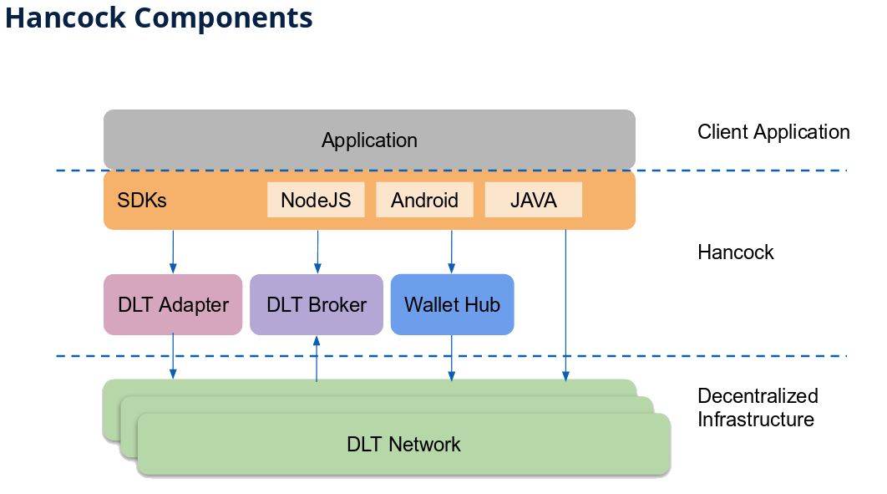

# Hancock guidebook 

Hancock is a research product conceived within <a href="https://www.bbva.com/ndb/es/">BBVA New digital businesses - R&D</a> that provides convenient services to integrate with different DLT networks. We provide simplicity, adaptability and efficiency to develop in any DLT. Hancock is a journey to industrial and productive Blockchain applications. And it's a free, open-source software, to work with blockchain networks. 

[Hancock](./getting-started/) can be divided into three main components:

- [DLT Adapter](./dlt-adapter/) 

- [Wallet Hub](./wallet-hub/) 

- [DLT Broker](./dlt-broker/) 

We also offer an SDK that provides a simplified consumption of all Hancock services. Reducing the time-to-market also ensures best practices, minimizing the risk for errors and improving product quality. You can read more about it in the [Hancock SDK](./sdk/) section.

## Motivation

Every blockchain has its own interfaces, even though they share a common functionality. 

Most applications have poor management of digital signatures, private keys and wallet management. A poor management of blockchain asynchronous nature, which also delays confirmations.

Hancock is like a bridge for blockchains, which offers an SDK and an API to manage connections to blockchain, so you can focus on developing your bussiness application.

## Why the name

John Hancock was the president of the Congress when the Declaration of Independence was adopted and signed. He is primarily remembered by Americans for his large, flamboyant signature on the Declaration, so much so that "John Hancock" became, in the United States, an informal synonym for signature.

Digital signatures are one of the most important cryptographic components of a blockchain. Hancock allows us to easily use digital signatures.

## Current blockchains supported

 - Ethereum

## Getting Started

Take a look to the [Hancock](./getting-started/) components, and start with an [example](./getting-started/#basic-example) to get to know the Hancock product.

## Concepts

If you need to remember some basic concepts about blockchain technologies, you can review those used on Hancock product [here](./getting-started/Concept/).

## Next steps

We are working on integrating other blockchain networks to the Hancock ecosystem. 

Next blockchain networks to be integrated are:
 - Bitcoin