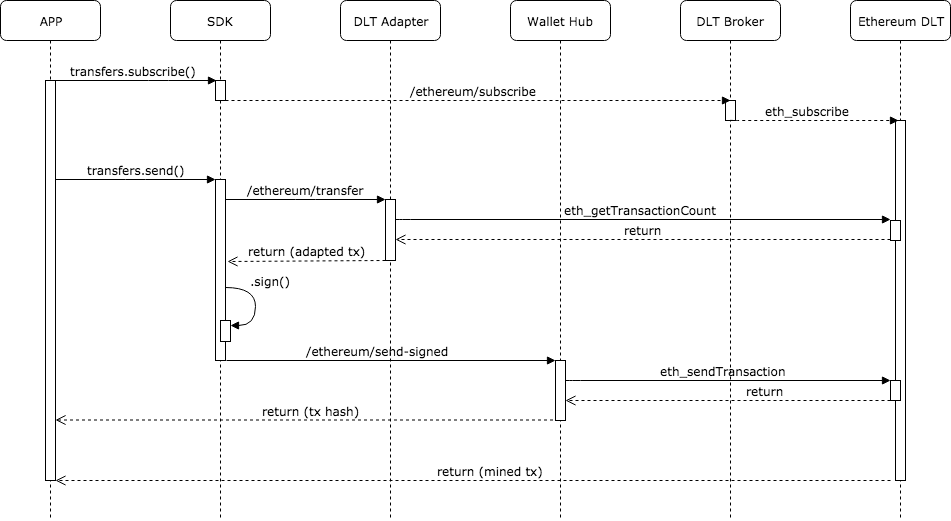

# Getting Started

## Overview

Hancock is a research product conceived within BBVA New digital business - R&D that provides convenient services to integrate with different DLT networks. We provide simplicity, adaptability and efficiently to develop in any DLT. Hancock can be divided into three main components:

- [DLT Adapter](../dlt-adapter/) - Keep it simple
Interface to abstract interaction with different DLT networks.

- [Wallet Hub](../wallet-hub/) - Enroute Interactions
Enable connect their signer wallets, or wallet service providers, to the wallet hub, that will then route any ready-to-sign transaction.

- [DLT Broker](../dlt-broker/) - Real time notifications
Provides a websocket connection that propagates any DLT event the user is subscribed. Thus, provides an interface to easily and efficiently subscribe to blockchain asynchronous events to avoid constant request of status.

To ease the orchestration between hancock's services and speed up the integration with them, we are providing a set of SDKs in different languages. You can read more about it in the [Hancock SDK](../sdk/) section.

Here is a big picture from the point of view of an application that is using hancock's ecosystem.


In order to comunicate with some of the supported DLTs, the application does not need to interact directly with hancock's microservices, instead of that, all the operations can be achieve by using a generic interface provided by the hancock SDK.

## Basic example

Let's see an example of one of the most trivial use cases that we can do using hancock, a blockchain transaction of kind "transfer" (that sends some network-native tokens from the sender account to the destination account).

To keep it simple, the application is going to sign the transaction locally providing the private key of the account that appears as sender in the transaction. Other signature processes as delegate signature using externals sign providers will be covered in detail in other sections of this guide.

Our example start in the client application, calling the transfer method of the [Hancock's nodejs SDK](../sdk/nodejs/):

```typescript
  // Instantiating the hancock nodeJs SDK
  import { HancockEthereumClient } from 'hancock-sdk';
  const hancockEthClient = new HancockEthereumClient(config);

  const sender = '0x34C54CB0d5cD1c0f5240324618adAD15ad6646AF';

  // Subscribing to transfers whose sender match with our address
  const subscription = hancockEthClient.transfers.subscribe([sender]);
  subscription.on('tx', (data) => { console.log(data) });
  subscription.on('error', (error) => { console.error(error) });

  // Sending the transfer transaction to the DLT (providing our private key)
  const result = await hancockEthClient.transfers.send(
    sender,
    '0x28a0686efb7dd9b625288a08649a6278cc4fd154',
    1000000000000000000,
    {
      privateKey: '0xd06026d5b8664036bdec0a924b8c7360566e678a2291e9440156365b040a7b83'
    }
  );
```

The activity flow under this interaction is the following:



As we can see, there is a first phase in which our transfer transaction is adapted from the hancock common transaction model to some DLT specific transaction model (in this case ethereum's model). This process is taking place in the [DLT Adapter](../dlt-adapter/) microservice.

Once we have the transaction adapted, we need to sign it before send it to the DLT, this proccess is done in the application memory by the SDK, so that way the private key never leaves the device.

After the signing process, our transaction is delivered to the DLT network through the [Wallet Hub](../wallet-hub/) microservice.

We can receive a confirmation once our transaction is mined in some block by the subscription that we have opened using the [DLT Broker](../dlt-broker/) microservice, watching transactions with sent by our sender address.

This is just a basic example to introduce Hancock, please keep reading this guide to explore all the possibilities that Hancock offers you for working with different DLTs faster and easy than ever.