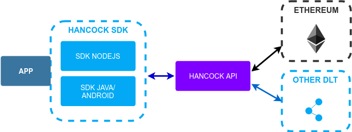

# SDK

Hancock users can make use of Hancock SDKs to orchestrate the requests and events to and from Hancock components required to perform application level operations.

To see an example of the main Hancock's workflows, take a look to next <a href="./workflow/">section</a>.

## Nodejs

SDK version to work with nodejs. To know more consult <a href="./nodejs/">Nodejs sdk</a>.

## Java

SDK version to work with java and android client. To know more consult <a href="./java/">Java sdk</a>.

## Services

Description of all kind of <a href="./services/">services</a> available to work with all Hancock components.
