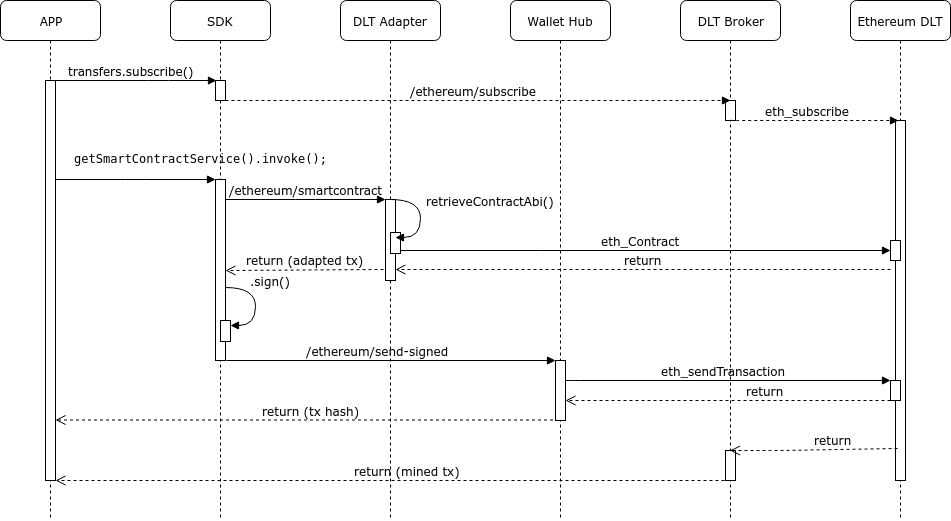

# Workflow

This section describes the main Hancock's workflows, to understand the integration with different Hancock's commponents.

## Get balance

We can make a petition to Hancock to get the <i>balance</i> of an specific account.

Our example start in the client application, calling the get-balance method of [Wallet service](../services/Wallet#get-balance):


```java

  address = '0x34C54CB0d5cD1c0f5240324618adAD15ad6646AF';

  hancockClient.getWalletService().getBalance(address);

```

The activity flow under this interaction is the following:


We make a call to the DLT network through the DLT-Adapter component, and return the balance of the account.

This operation dont need to make modifications on the network, the action does not consume any fees.

## Transaction

A blockchain transaction of type <i>"transfer"</i> (that sends some network-native tokens from the sender account to the destination account).

The complete example is available in the [getting-started](../../getting-started/#basic-example) section.

## Smartcontract

We can invoke any operation of a smart contract deployed on a DLT network.

Once we have deployed and registered our contract, we can call the <i>invoke</i> method of [SmartContract service](../services/SmartContract.html#invoke-a-smart-contract):

```java

  contractAddressOrAlias = '0xcffffffffffffff000000000000000000000000';
  method = "attest";
  params = ["2"];
  from = '0x34C54CB0d5cD1c0f5240324618adAD15ad6646AF';

  hancockClient.getSmartContractService().invoke(contractAddressOrAlias, method, params, from);

```
The write operation on a DLT network consumes fees and we need to wait for it to be mined.

First of all we need to subscribe to be able to listen the final response. In the first phase, our invoke is adapted and confirmed with the abi model. This process is taking place in the DLT Adapter microservice.

