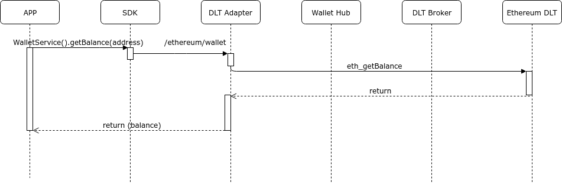

# Workflow

## Transaction

A blockchain transaction of kind "transfer" (that sends some network-native tokens from the sender account to the destination account).

Can see the complete example on [getting-started](../../getting-started/#basic-example) section.

## Get balance

We can make a petition to Hancock to get the balance of an specific account.

Our example start in the client application, calling the get-balance method of [Wallet service](../services/Wallet#get-balance):


```java

  address = '0x34C54CB0d5cD1c0f5240324618adAD15ad6646AF';

  ethereumClient.getWalletService().getBalance(address);

```

The activity flow under this interaction is the following:



This operation dont need to make modifications on the network, the action does not consume any fees.

## Smartcontract
